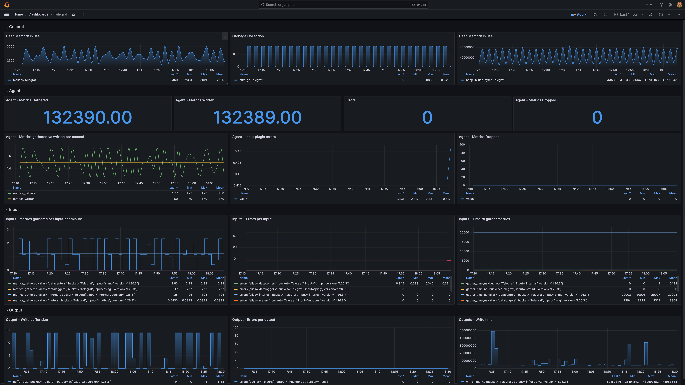

# Telegraf Dashboard for Grafana

This is the Grafana version of the [Telegraf metrics monitoring template](https://github.com/influxdata/community-templates/tree/master/telegraf) for InfluxDB.

## Prerequisites
This dashboard assumes that you already set up:
* An InfluxDB instance and its relative datasource in Grafana
* A bucket named `Telegraf` with 7 days retention
* A Telegraf `config` plugin for internal metrics collection and InfluxDB v2 output

Details about the setup instruction can be found [here](https://github.com/influxdata/community-templates/tree/master/telegraf)

## Metrics collected
This dashboard allows to monitor the Telegraf agent, input plugins, set up alarms, identify errors in the metrics collection and so on.
The following is a non exaustive list of the metrics collected from Telegraf internal metrics plugin.

* Number of metrics collected
* Metrics collected vs written per second
* Metrics gathered per input per minute
* Write buffer size
* Memory Allocations
* Metrics written
* Input plugin errors
* Errors per input
* Errors per output
* Garbage collection

## References
* [Telegraf Dashboard](https://github.com/influxdata/community-templates/tree/master/telegraf)
* [Telegraf Monitoring Template](https://www.influxdata.com/influxdb-templates/telegraf-monitor/)
